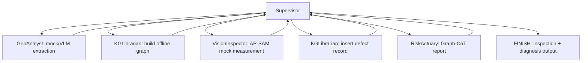

# AeroGuardian Engineering Alignment Design

Date: 2026-05-24

## Goal

Make the current codebase engineering-consistent with the AeroGuardian paper while keeping the default verification path fully offline. The implementation should demonstrate the paper's end-to-end architecture with deterministic mocks for external systems, and keep Neo4j, OpenAI/Qwen, AP-SAM, and Halcon as optional production adapters.

The default success path is:

1. Run locally without Neo4j.
2. Run locally without OpenAI/Qwen credentials.
3. Execute a complete Supervisor-Worker workflow.
4. Produce a traceable inspection and diagnosis result that follows the paper's architecture.
5. Verify the behavior with automated tests.

## Paper Architecture Summary

The paper describes AeroGuardian as a LangGraph-based multi-agent GraphRAG system for aviation sheet-metal quality risk control. Its core structure is a Supervisor-Worker topology:

- `Supervisor`: central routing, task decomposition, semantic decision making, deterministic boundary checks, and Critic Loop control.
- `GeoAnalyst`: multimodal drawing perception, geometric feature extraction, tolerance state detection, robust JSON parsing, and extraction confidence estimation.
- `KGLibrarian`: knowledge graph construction, ontology management, process-card fusion, feature-process linking, defect record insertion, and graph update.
- `RiskActuary`: Graph-CoT risk reasoning, evidence-chain retrieval, risk aggregation, strict-mode handling, and dynamic inspection or diagnosis output.

The paper's runtime flow is:

1. Parse drawing and process-card data.
2. Build a part-level graph with features, process steps, resources, standards, tolerances, defects, and root causes.
3. Run AP-SAM plus the downstream vision measurement system.
4. Compare measured values against in-memory tolerances.
5. Trigger an anomaly event for out-of-tolerance features.
6. Insert a dynamic defect record into the graph.
7. Run Graph-CoT from the anomaly context to find causal paths.
8. Produce a risk control, inspection, and diagnosis result.
9. Trigger Critic Loop / human review when confidence is below the safety threshold.

The paper also describes cloud-edge teacher-student distillation. For this project scope, cloud-edge distillation is represented as an adapter boundary and exportable training-data interface, not as a full model-training subsystem.

## Current Codebase Findings

The repository already contains useful pieces:

- `src/swarm` defines a LangGraph-style Supervisor-Worker workflow.
- `src/extractor.py` supports VLM extraction and deterministic mock extraction.
- `src/parse_process_card.py` parses process cards and extracts tolerance rules.
- `src/graph_builder.py` builds a Neo4j graph and performs some feature-process linking.
- `src/risk_miner.py` performs vector-anchored risk retrieval against Neo4j.
- `src/cognitive_planner.py` generates adaptive inspection plans with deterministic fallback.
- `src/process_diagnosis.py` diagnoses measured defects against tolerances.

There are also important gaps:

- The swarm currently fails to compile in the local environment because `langchain.agents.create_tool_calling_agent` is unavailable in LangChain 1.2.0.
- `GeoAnalyst` references `GEO_ANALYST_PROMPT`, but the defined constant is `GEO_ANALYST_SYSTEM_PROMPT`.
- The default workflow assumes Neo4j and LLM access in several paths, so it is not reliably testable offline.
- AP-SAM/vision measurement and anomaly triggering are described in docs but not represented as a runnable workflow stage.
- `DefectRecord` and `RootCause` are not first-class offline entities in the default workflow.
- Graph-CoT is simplified to vector search over historical defects; it does not yet expose the paper's two-level retrieval and causal path explanation in an offline mode.
- Current tests include at least one false-positive pattern: `pytest tests/test_imports.py` can pass while the internal import check returns `False`.

## Design Direction

Use an offline-first architecture with explicit backend adapters.

The implementation should not pretend that external production systems are available. Instead, it should make the paper's system executable through deterministic local components:

- Use mock drawing/process data where API calls are unavailable.
- Use an in-memory graph repository for offline tests.
- Use AP-SAM measurement mocks to represent the segmentation and measurement boundary.
- Use deterministic Graph-CoT retrieval rules over the in-memory graph.
- Preserve Neo4j/OpenAI-backed modules as optional adapters.

This gives the project a testable engineering core while keeping production integration points clear.

## Proposed Components

### 1. Compatibility and Execution Baseline

Create a stable offline execution path for `src/swarm`.

Required behavior:

- Importing and compiling the swarm workflow should not require unavailable LangChain agent helpers.
- Worker nodes should be able to execute deterministic tool calls directly.
- LLM/tool-calling agents can remain optional, but the default test path should not depend on them.
- Validation tests should fail truthfully when imports or workflow compilation fail.

Likely change:

- Replace mandatory `create_tool_calling_agent` usage in worker nodes with a direct service/tool execution path.
- Keep prompts as documentation or optional future LLM mode.

### 2. State Model Alignment

Extend `AgentState` to include paper-level runtime signals:

- `measurement_data`: measured values emitted by AP-SAM/Halcon mock.
- `anomaly_event`: structured out-of-tolerance event.
- `defect_record`: graph-ready defect record generated from anomaly data.
- `graph_cot_report`: causal evidence paths, risk score, confidence, and recommendation.
- `human_review_required`: whether Critic Loop/human review should be triggered.

State update semantics remain aligned with the paper:

- `messages` use append semantics.
- Structured outputs use overwrite semantics.
- Control flags are centralized through `Supervisor`.

### 3. GeoAnalyst Offline Contract

Normalize extracted features into a paper-aligned schema:

```json
{
  "feature_id": "Hole_01",
  "type": "HoleDiameter",
  "target_value": 6.0,
  "unit": "mm",
  "tolerance": {
    "upper": 0.1,
    "lower": -0.1,
    "source": "drawing|process_card|standard|missing",
    "state_indicator": 0
  },
  "confidence": 0.95,
  "bbox": [0, 0, 100, 100]
}
```

Tolerance state mapping:

- `0`: explicit tolerance found.
- `1`: no explicit drawing tolerance; downstream standard/process-card fusion should resolve it.
- `2`: unreadable or low-confidence tolerance; human review required.

The offline mock extractor should produce at least one normal feature and at least one feature suitable for anomaly testing.

### 4. Offline Graph Repository

Introduce a graph repository boundary. The default implementation is in-memory; Neo4j remains an adapter.

The repository should support:

- Upserting `Part`, `GeoFeature`, `ProcessStep`, `ProcessParam`, `Standard`, `Resource`.
- Linking `Part -> GeoFeature`.
- Linking `Part -> ProcessStep`.
- Linking `ProcessStep -> GeoFeature` through `PRODUCES`.
- Linking `ProcessStep -> Resource` and `ProcessStep -> Standard`.
- Inserting `DefectRecord` from anomaly events.
- Linking `DefectRecord -> RootCause`.
- Querying exact defect history by `part_id` and `feature_id`.
- Querying similar evidence by feature type, process capability, and resource.

This repository should be small and deterministic. It does not need to replace Neo4j for production. It provides a faithful local substrate for the paper workflow.

### 5. AP-SAM Measurement Mock and Anomaly Trigger

Add an explicit vision measurement boundary:

- `APSamMeasurementProvider` interface.
- `MockAPSamMeasurementProvider` implementation.

The mock provider can:

- Read measurements from a JSON file if supplied.
- Otherwise generate deterministic measurements from known mock features.

The anomaly trigger should:

1. Read feature tolerances from `AgentState.drawing_data` or fused graph state.
2. Compare each measured value against `[target + lower, target + upper]`.
3. Emit an `anomaly_event` only for out-of-tolerance features.
4. Produce a structured natural-language prompt matching the paper's format:
   `Part:<part_id>, FeatID:<feature_id>, Step:<step>, Size:<target>mm, Dev:<delta>mm`.
5. Mark pass/no-anomaly cases as successful inspection results.

This must be in-memory first and must not require a Neo4j query during the trigger.

### 6. KGLibrarian Dynamic Defect Update

When an anomaly event exists, `KGLibrarian` should insert a defect record through the repository boundary.

Defect record fields:

- `defect_id`
- `part_id`
- `feature_id`
- `measured_value`
- `target_value`
- `deviation`
- `severity`
- `occurred_at`
- `source`: `ap_sam_mock|ap_sam|manual`

For offline Graph-CoT tests, seed at least one historical defect/root-cause path and insert the current defect dynamically.

### 7. Graph-CoT Engineering Implementation

Implement an offline Graph-CoT service used by `RiskActuary`.

It should follow the paper's two-level retrieval:

- Level 1 exact retrieval:
  - Match historical defects for the same `part_id` and `feature_id`.
  - If found, return direct evidence chain with highest priority.
- Level 2 generalized retrieval:
  - If no direct match exists, find similar graph anchors by feature type, process step capability, and resource.
  - Traverse deterministic paths from feature to process/resource/root-cause evidence.

The report should include:

- `serialized_context`
- `retrieval_level`
- `evidence_paths`
- `risk_types`: process-state risk and equipment-resource risk where available.
- `risk_score`
- `confidence`
- `root_cause`
- `recommendations`
- `requires_human_review`

Risk scoring should be deterministic and explainable. A practical engineering approximation is acceptable:

- Direct exact evidence has highest weight.
- Process-path evidence has weight `0.7`.
- Resource-path evidence has weight `0.3`.
- Distance decay uses `0.8`.
- Confidence below `0.95` triggers human review, matching the paper's Critic Loop threshold.

### 8. Supervisor Routing

Supervisor routing should enforce the paper's deterministic boundary checks:

- If no drawing data, route to `GeoAnalyst`.
- If no process/graph data, route to `KGLibrarian`.
- If no measurement data, route to `VisionMeasurement` or equivalent workflow stage.
- If anomaly exists but no defect record, route to `KGLibrarian`.
- If anomaly exists and no Graph-CoT report, route to `RiskActuary`.
- If Graph-CoT report requires review, set strict mode / human review.
- Otherwise finish.

Because the current workflow only has three worker nodes, there are two acceptable implementation options:

- Add a `VisionInspector` worker node.
- Or let `RiskActuary` own the measurement/anomaly step before Graph-CoT.

Recommended option: add `VisionInspector`. It maps directly to the paper's AP-SAM bridge and keeps responsibilities clear.

### 9. Cloud-Edge Boundary

Do not implement full model training in this engineering pass.

Instead, provide:

- A graph linearization utility that can serialize an evidence subgraph with `<Node>`, `<Edge>`, and `<Attr>` tags.
- A distillation sample export shape:

```json
{
  "input_context": "...",
  "linearized_subgraph": "...",
  "teacher_reasoning": "...",
  "risk_label": "process_state|resource|unknown",
  "recommendation": "..."
}
```

This makes the cloud-edge section traceable and extensible without turning the codebase into a training framework.

## End-to-End Offline Flow

The offline workflow should look like this:



If all measurements are in tolerance, the workflow should finish with an inspection-pass result and no Graph-CoT defect diagnosis.

If one measurement is out of tolerance, the workflow should produce:

- `anomaly_event`
- `defect_record`
- `graph_cot_report`
- `inspection_plan`
- `human_review_required` when confidence is below threshold.

## Testing Strategy

Add or update tests so the offline contract is proven.

Required tests:

- Import and workflow compilation test that fails truthfully on import errors.
- Offline graph repository unit tests.
- AP-SAM mock measurement and anomaly predicate tests.
- Graph-CoT Level 1 exact retrieval test.
- Graph-CoT Level 2 generalized retrieval test.
- Full offline swarm workflow test with no Neo4j/OpenAI dependency.
- No-anomaly path test.
- Human-review threshold test.

Verification command target:

```powershell
python -m pytest tests -q
```

If existing tests depend on Neo4j/OpenAI, mark them as integration tests or gate them behind explicit environment variables.

## Non-Goals

This pass will not:

- Train or fine-tune a student model.
- Implement real AP-SAM or Halcon measurement.
- Require live Neo4j in default tests.
- Require OpenAI/Qwen credentials in default tests.
- Build a frontend for human review.
- Rewrite the whole legacy `MainAgent` pipeline unless needed to expose the same offline services.

## Open Questions for Review

1. Should `VisionInspector` be a new LangGraph worker node, or should measurement/anomaly detection live inside `RiskActuary` for a smaller change?
2. Should offline graph storage be purely in-memory, or should it optionally persist to a JSON file for debugging?
3. Should the first implementation preserve the legacy CLI commands, or add a new `offline-aeroguardian` command for the paper-aligned workflow?

## Recommended Decisions

Recommended defaults:

- Add `VisionInspector` as a fourth worker node.
- Use in-memory graph storage for tests, with optional JSON export for debugging.
- Add a new explicit offline command while keeping existing CLI commands stable.

These decisions give the codebase a clear paper-aligned workflow without breaking existing legacy usage.

## Spec Self-Review

Placeholder scan: no unresolved TBD/TODO placeholders remain.

Consistency check: the design maps each paper subsystem to an engineering component and keeps external production systems behind adapters.

Scope check: this is a single implementation plan if executed in vertical slices: compatibility baseline, offline graph, vision anomaly, Graph-CoT, orchestration, tests/docs.

Ambiguity check: cloud-edge distillation is explicitly scoped to export/linearization only, not model training. AP-SAM and Halcon are explicitly mocked by default.
